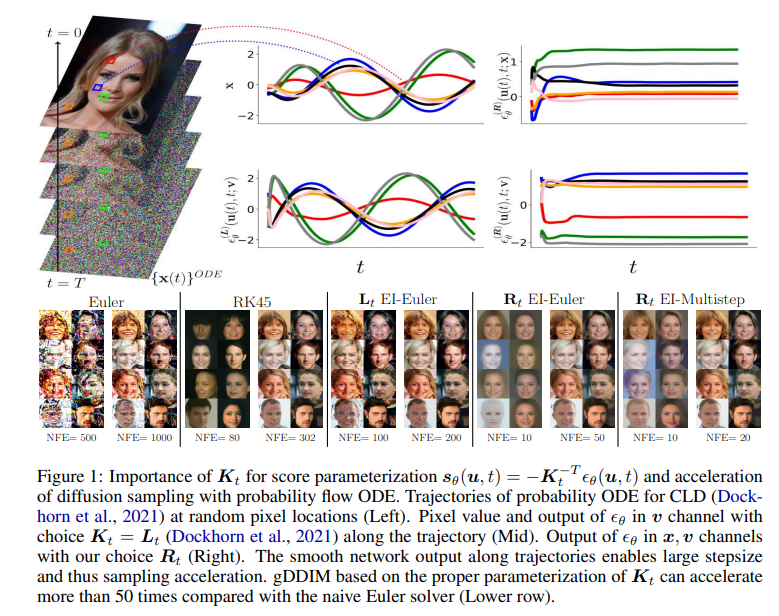

# <p align="center">gDDIM: Generalized denoising diffusion implicit models</p>

<div align="center">
  <a href="https://qsh-zh.github.io/" target="_blank">Qinsheng&nbsp;Zhang</a> &emsp; <b>&middot;</b> &emsp;
  <a href="https://mtao8.math.gatech.edu/" target="_blank">Molei&nbsp;Tao</a> &emsp; <b>&middot;</b> &emsp;
  <a href="https://yongxin.ae.gatech.edu/" target="_blank">Yongxin&nbsp;Chen</a>
  <br> <br>
  <a href="https://arxiv.org/abs/2206.05564" target="_blank">Paper</a> &emsp;
</div>
<br><br>

**TLDR**: We unbox the accelerating secret of DDIMs based on Dirac approximation and generalize it to general diffusion models, isotropic and non-isotropic. 

<!-- When applied to the critically-damped Langevin diffusion model, it achieves an FID score of 2.26 on CIFAR10 with 50 steps. -->

 


# Setup

The codebase is only tested in docker environment.

## Docker

* [Dockerfile](Dockfile) lists necessary steps and packages to setup training / testing environments.
* We provide a [Docker Image](https://hub.docker.com/repository/docker/qinsheng/gddim/general) in [DockerHub](https://hub.docker.com/)

# Reproduce results

## CLD

### Training on cifar10

```shell
cd ${gDDIM_PROJECT_FOLDER}
wandb login ${WANDB_KEY}
python main.py --config configs/accr_dcifar10_config.py --mode train --workdir logs/accr_dcifar_nomixed --wandb --config.seed=8
```

* I have randomly try seed=`1,8,123`. And `seed=8` (checkpoint 15) gives the best FID while the lowest FIDs from other two are slightly high (around 2.30) in CIFAR10.

### Eval on cifar10

1. Download [CIFAR stats](https://drive.google.com/file/d/1gw8sTGUUf4aZG4sNmwMj9rjmTfNv4eed/view?usp=sharing) to `assets/stats/`.

2. We provide pretrain model [checkpoint](https://drive.google.com/file/d/1Wi9xOVJS03KDzD3eFpC1whHrzxf7P1cy/view?usp=sharing).
> the checkpoint has 2.2565 FID in my machine with 50 NFE
3. User can evaluate FID via
```shell
cd ${gDDIM_PROJECT_FOLDER}
python main.py --config configs/accr_dcifar10_config.py --mode check --result_folder logs/fid --ckpt ${CLD_BEST_PATH} --config.sampling.deis_order=2 --config.sampling.nfe=50
```

## Blur diffusion model

Please check out [blur branch](https://github.com/qsh-zh/gDDIM/tree/clean).

# Reference

```tex
@misc{zhang2022gddim,
      title={gDDIM: Generalized denoising diffusion implicit models}, 
      author={Qinsheng Zhang and Molei Tao and Yongxin Chen},
      year={2022},
      eprint={2206.05564},
      archivePrefix={arXiv},
      primaryClass={cs.LG}
}
```

Related works

```tex
@inproceedings{song2020denoising,
  title={Denoising diffusion implicit models},
  author={Song, Jiaming and Meng, Chenlin and Ermon, Stefano},
  booktitle={International Conference on Learning Representations (ICLR)},
  year={2021}
}

@inproceedings{dockhorn2022score,
    title={Score-Based Generative Modeling with Critically-Damped Langevin Diffusion},
    author={Tim Dockhorn and Arash Vahdat and Karsten Kreis},
    booktitle={International Conference on Learning Representations (ICLR)},
    year={2022}
}

@article{hoogeboom2022blurring,
  title={Blurring diffusion models},
  author={Hoogeboom, Emiel and Salimans, Tim},
  journal={arXiv preprint arXiv:2209.05557},
  year={2022}
}
```


## Miscellaneous

The project is built upon [score-sde](https://github.com/yang-song/score_sde) developed by [Yang Song](https://yang-song.net/). Additionally, the sampling code has been adopted from [DEIS](https://github.com/qsh-zh/deis).