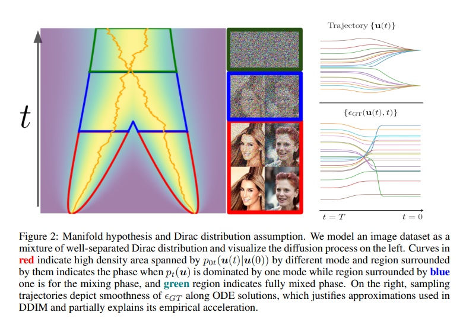

# <p align="center">gDDIM: Generalized denoising diffusion implicit models</p>

<div align="center">
  <a href="https://qsh-zh.github.io/" target="_blank">Qinsheng&nbsp;Zhang</a> &emsp; <b>&middot;</b> &emsp;
  <a href="https://mtao8.math.gatech.edu/" target="_blank">Molei&nbsp;Tao</a> &emsp; <b>&middot;</b> &emsp;
  <a href="https://yongxin.ae.gatech.edu/" target="_blank">Yongxin&nbsp;Chen</a>
  <br> <br>
  <a href="https://arxiv.org/abs/2206.05564" target="_blank">Paper</a> &emsp;
</div>
<br><br>

**TLDR**: We unbox the accelerating secret of DDIMs based on Dirac approximation and generalize it to general diffusion models, isotropic and non-isotropic. 

<!-- When applied to the critically-damped Langevin diffusion model, it achieves an FID score of 2.26 on CIFAR10 with 50 steps. -->

 


# Setup

## Docker

## From scratch

# Reproduce results

## CLD

Download the [checkpoint]() and evaluate FID
> the checkpoint has 2.2565 FID in my machine with 50 NFE

```shell
# todo
```

# Reference

```tex
@misc{zhang2022gddim,
      title={gDDIM: Generalized denoising diffusion implicit models}, 
      author={Qinsheng Zhang and Molei Tao and Yongxin Chen},
      year={2022},
      eprint={2206.05564},
      archivePrefix={arXiv},
      primaryClass={cs.LG}
}
```

Related works

```tex
@inproceedings{song2020denoising,
  title={Denoising diffusion implicit models},
  author={Song, Jiaming and Meng, Chenlin and Ermon, Stefano},
  booktitle={International Conference on Learning Representations (ICLR)},
  year={2021}
}

@inproceedings{dockhorn2022score,
    title={Score-Based Generative Modeling with Critically-Damped Langevin Diffusion},
    author={Tim Dockhorn and Arash Vahdat and Karsten Kreis},
    booktitle={International Conference on Learning Representations (ICLR)},
    year={2022}
}

@article{hoogeboom2022blurring,
  title={Blurring diffusion models},
  author={Hoogeboom, Emiel and Salimans, Tim},
  journal={arXiv preprint arXiv:2209.05557},
  year={2022}
}
```
